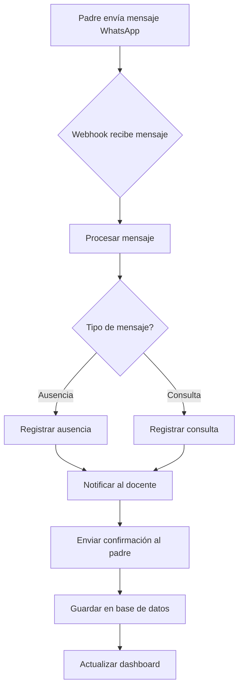
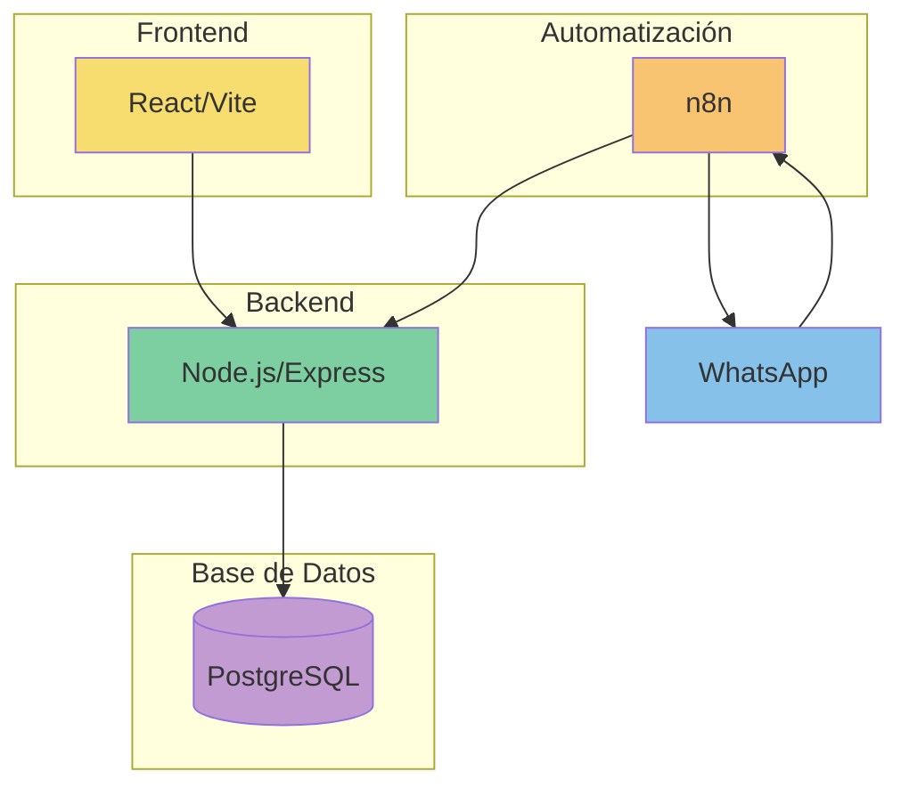

# Plan de Implementación: Sistema de Automatización de Mensajes para CCJAP

## Resumen del Proyecto

El Colegio Cristiano Doctor Juan Allwood Paredes requiere un sistema para automatizar el proceso de gestión de mensajes de WhatsApp enviados por padres de familia. Específicamente, necesitan:

1. Procesar mensajes de WhatsApp donde los padres notifican ausencias o hacen consultas
2. Enviar automáticamente estos mensajes al docente correspondiente
3. Proporcionar confirmación automática a los padres
4. Mantener un registro de ausencias y consultas
5. Ofrecer un dashboard para monitorear estos datos

## Arquitectura del Sistema

El sistema se implementará utilizando:

- **Frontend**: React/Vite para la interfaz de usuario
- **Backend**: Node.js/Express para la API REST
- **Base de Datos**: PostgreSQL para almacenamiento persistente
- **Automatización**: n8n para flujos de trabajo automatizados
- **Despliegue**: Docker para contenerización

## Componentes Implementados

Hasta el momento, se han implementado los siguientes componentes:

1. **Base de Datos**:
   - Configuración de PostgreSQL en Docker
   - Esquema de base de datos actualizado con las tablas:
     - `waapi_config`: Almacena la configuración de la API de WhatsApp
     - `whatsapp_messages`: Registro de mensajes enviados y recibidos
     - `mensajes_whatsapp`: Almacena mensajes recibidos
     - `ausencias`: Registra ausencias de alumnos

2. **API Endpoints**:
   - `POST /api/waapi/config`: Guardar configuración de WhatsApp
   - `GET /api/waapi/config`: Obtener configuración actual
   - `POST /api/waapi/test-connection`: Probar conexión con n8n
   - `POST /api/waapi/send-message`: Enviar mensaje a través de WhatsApp
   - `POST /api/webhook/whatsapp`: Webhook para recibir mensajes de WhatsApp
   - `POST /api/webhook/ausencias`: Gestión de ausencias
   - `GET /api/webhook/mensajes`: Consulta de mensajes

3. **Lógica de Negocio**:
   - Procesamiento automático de mensajes
   - Detección de tipo de mensaje (ausencia, consulta)
   - Notificación a docentes
   - Confirmación a padres
   - Gestión de configuración de la API de WhatsApp
   - Validación de mensajes entrantes
   - Registro de auditoría de operaciones

## Pendiente por Implementar

Para completar el sistema, aún es necesario:

### Frontend

1. **Página de Ausencias**:
   - Tabla de visualización de ausencias
   - Filtros por fecha, alumno, justificación
   - Estadísticas de ausencias

2. **Página de Mensajes**:
   - Visualizador de mensajes recibidos
   - Sistema para responder mensajes
   - Histórico de conversaciones

3. **Dashboard**:
   - Gráficas de ausencias por periodo
   - Indicadores de rendimiento
   - Alertas de ausencias frecuentes

### n8n

1. **Flujo para Mensajes Entrantes**:
   - Trigger desde webhook de WhatsApp
   - Procesamiento de mensaje
   - Identificación de alumno y docente
   - Envío de notificaciones al backend
   - Configuración de respuestas automáticas

2. **Flujo para Mensajes Salientes**:
   - Recepción de peticiones desde el backend
   - Envío a través de la API de WhatsApp
   - Confirmación de entrega
   - Actualización de estado

3. **Flujo para Reportes**:
   - Generación automática de reportes
   - Envío programado a directivos
   - Alertas de mensajes no entregados

### Integración

1. **Conexión WhatsApp**:
   - Configuración del proveedor de API de WhatsApp
   - Configuración de webhooks
   - Pruebas de envío y recepción
   - Manejo de errores y reintentos

2. **Monitoreo**:
   - Logging detallado de mensajes
   - Alertas de errores
   - Dashboard de estado
   - Métricas de rendimiento

3. **Seguridad**:
   - Autenticación de webhooks
   - Validación de firmas
   - Registro de auditoría
   - Rotación de claves

## Diagrama de Flujo del Proceso

## Diagrama de Arquitectura

## Próximos Pasos

1. **Implementar Frontend**:
   - Crear componentes React para visualización y gestión de mensajes
   - Implementar autenticación y control de acceso por roles
   - Desarrollar dashboard de monitoreo
   - Crear formularios de configuración

2. **Configurar n8n**:
   - Importar flujos de trabajo predefinidos
   - Configurar webhooks para mensajes entrantes
   - Establecer plantillas de respuestas automáticas
   - Programar tareas de mantenimiento

3. **Optimización**:
   - Mejorar manejo de errores
   - Implementar reintentos automáticos
   - Optimizar consultas a la base de datos
   - Configurar respaldo automático de mensajes

3. **Pruebas**:
   - Pruebas unitarias
   - Pruebas de integración
   - Pruebas de usuario final
cd /opt/ccjap
docker-compose down
4. **Despliegue**:
   - Preparar contenedores Docker
   - Configuración de VPS
   - Implementación de SSL

## Conclusión

El sistema propuesto automatizará completamente el flujo de comunicación entre padres y docentes, liberando tiempo del director y proporcionando un registro centralizado de todas las interacciones. La arquitectura basada en contenedores permitirá un despliegue sencillo y escalable.

Para implementar este plan, se recomienda cambiar al modo Código (💻 Code) para desarrollar los componentes frontend y completar la integración con n8n.